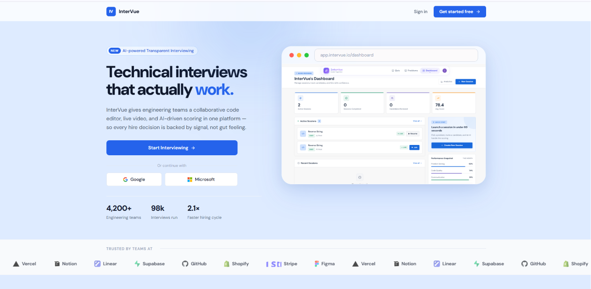

# InterVue



InterVue is an AI-powered hiring and technical interview platform. It combines job postings, applicant pipelines, live collaborative coding interviews, AI proctoring, automated candidate evaluation, and recruiter analytics into a single system for engineering teams.

---

## Overview

Hiring engineers usually means stitching together a job board, a video-call tool, a separate coding-assessment tool, spreadsheets for tracking applicants, and manual note-taking for evaluation.

InterVue replaces that stack with one workspace: recruiters post jobs and manage a candidate pipeline, candidates apply and take quizzes/interviews, interviewers run live collaborative coding sessions with video, and AI assists with proctoring, scoring, and summarizing every interview.

---

## Key Features

### Hiring & Applicant Tracking

* Job posting and management
* Candidate application intake and resume parsing
* Candidate pipeline / stage tracking (recruiter Pipeline view)
* Fit-score generation matching candidates to job criteria
* Interviewer requests and waitlist management
* Recruiter analytics dashboard (interview stats, hiring trends, session activity)

### Real-Time Collaborative Coding

* Shared Monaco-based code editor for interviewer and candidate
* Multi-language code execution via an integrated judge
* Live synchronization across participants
* Coding problem bank with problem management tools
* Quiz module for non-coding technical assessment
* Collaborative whiteboard (Excalidraw)

### Integrated Video Interviewing

* Video communication powered by Stream Video
* In-session chat powered by Stream Chat
* Screen sharing support
* Session creation, joining, and history

### AI Proctoring Agent


* Browser-based face detection during interviews (MediaPipe Face Mesh)
* Continuous candidate presence and attention monitoring
* Session violation logging
* Real-time visual indicators for interviewers

### AI-Assisted Evaluation & Content Generation

* Automated interview evaluation and performance scoring
* AI-generated interview summaries (strengths, gaps, hiring recommendation) via OpenRouter
* AI-assisted candidate autofill and job-matching helpers
* Downloadable performance reports (PDF)

### Identity Verification

* Aadhaar-based identity verification with OCR field extraction (Tesseract.js)
* DigiLocker integration flow
* Aadhaar checksum validation and duplicate-account detection

### Admin Console

* User management and role-based access
* Audit log of system actions
* Billing and subscription management
* Email template management (Resend)
* System health monitoring
* App-wide settings and maintenance mode

### Authentication & Security

* Authentication and session management via Clerk
* Protected routes and role-based route guards
* Subscription-gated feature access

---

## Technology Stack

### Frontend

* React 19 + Vite
* React Router
* Clerk (authentication)
* Stream Video & Chat SDKs
* Monaco Editor
* Excalidraw
* MediaPipe (face detection)
* TanStack React Query
* Tailwind CSS + daisyUI
* Framer Motion
* Recharts

### Backend

* Node.js + Express 5
* MongoDB + Mongoose
* Clerk (Express SDK)
* Inngest (background jobs / event workflows)
* Stream (video & chat server SDKs)
* OpenRouter (AI evaluation, summaries, content generation)
* Tesseract.js (Aadhaar OCR)
* Cloudinary (media storage)
* Resend (transactional email)
* PDFKit (report generation)

### Deployment

* Vercel (frontend) — see `frontend/vercel.json`
* Node hosting of your choice for the backend (Render / Railway / VPS)
* MongoDB Atlas
* Clerk, Stream, Cloudinary, Resend, and OpenRouter as managed services

---

## Architecture

```text
Frontend (React + Vite)
        |
        v
Backend (Node.js + Express)
        |
        +---- MongoDB (Mongoose)
        |
        +---- Clerk Authentication
        |
        +---- Stream Video / Chat
        |
        +---- OpenRouter (AI evaluation & generation)
        |
        +---- Cloudinary (media)
        |
        +---- Resend (email)
        |
        +---- Inngest (background workflows)
```

---

## Environment Variables

These are the variables actually read by the code (`backend/src/lib/env.js` and direct `process.env` usage, plus the frontend's `import.meta.env` calls). Add Clerk keys as required by `@clerk/express` / `@clerk/clerk-react` even though they aren't listed in the backend's central `ENV` object.

### Frontend (`frontend/.env`)

```env
VITE_CLERK_PUBLISHABLE_KEY=
VITE_API_URL=
VITE_STREAM_API_KEY=
```

### Backend (`backend/.env`)

```env
PORT=
DB_URL=
NODE_ENV=development

CLIENT_URL=

CLERK_SECRET_KEY=

JWT_SECRET=

STREAM_API_KEY=
STREAM_API_SECRET=

INNGEST_EVENT_KEY=
INNGEST_SIGNING_KEY=

RESEND_API_KEY=
RESEND_FROM_EMAIL=
RESEND_REPLY_TO=

CLOUDINARY_CLOUD_NAME=
CLOUDINARY_API_KEY=
CLOUDINARY_API_SECRET=

OPENROUTER_API_KEY=
OPENROUTER_PRIMARY_MODEL=
OPENROUTER_FALLBACK_MODELS=

ADMIN_EMAIL=
```

---

## Installation

### Clone the repository

```bash
git clone <your-repository-url>
cd InterVue-InterVuePro
```

### Install dependencies

```bash
# from the project root, installs both frontend and backend
npm run build
```

Or install each workspace individually:

```bash
cd backend && npm install
cd ../frontend && npm install
```

---

## Running Locally

### Start the backend

```bash
cd backend
npm run dev
```

### Start the frontend

```bash
cd frontend
npm run dev
```

* Frontend: `http://localhost:5173`
* Backend: value of `PORT` in `backend/.env`

---

## Why InterVue

InterVue was built to remove the fragmentation in technical hiring — separate tools for job postings, applicant tracking, video calls, coding assessments, identity checks, and evaluation. By bringing all of it into one platform with AI-assisted proctoring and scoring, InterVue helps hiring teams move faster and make more consistent decisions.

---

## License

InterVue is **proprietary, source-available software** — it is **not open source**. The source is provided for viewing, evaluation, and educational purposes only.

Without a separate written commercial agreement, you may **not** use, modify, host, deploy, redistribute, or build derivative or competing products from this codebase, including for commercial or production purposes.

See [`LICENSE`](./LICENSE) for the full terms (InterVue Proprietary Source-Available License v1.0). For commercial licensing or deployment inquiries, contact the copyright holder.

> **Note:** The `LICENSE` file attributes copyright to **Blue Horizon**. If this project is actually owned by a different entity (e.g. AlphaWare Private Limited), update the copyright holder name in `LICENSE` accordingly so the two stay consistent.

---

Developed by Blue Horizon.
